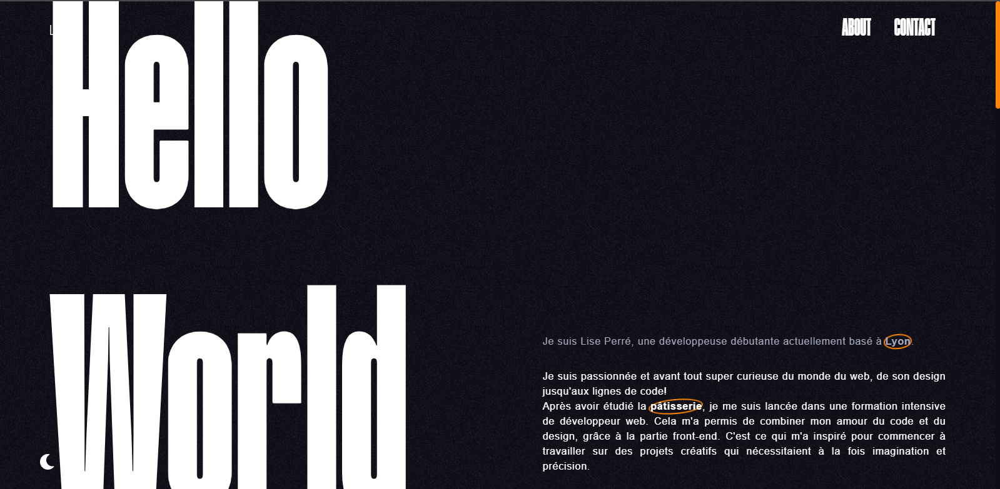

# Site Web | Portfolio

## À propos

Ce projet a été mon fil rouge durant toute ma formation. Il m'a permit d'appliquer ce que j'ai appris durant l'année 2021 en HTML, CSS, JavaScript, mais aussi en maquettage et UI/UX design. 
Le but de ce projet était de pouvoir avoir un premier site internet, qui puisse me représenter sur le web et d'y afficher mes compétences.
Le site est donc très simple, mais l'idée est qu'il puisse être perfectionnable et que je puisse le changer au cours du temps. Tel un vrai bac à sale ce site a pour but de bouger au cours du temps et de m'acompagner dans ma vie de développeuse.

Ce site ne contient aucun back-end, il contient seulement une partie front.
Le site est hébergé sur <a href="https://hydrenoire.github.io/" target="_blank">une page GitHub</a>

### Langages & Frameworks

       

